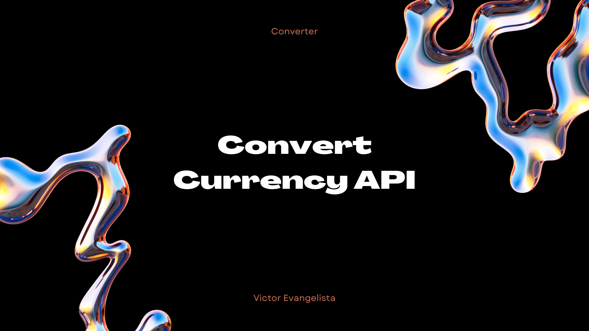

     

# Introduction

## This project is developed based on the previous converter project [ConvertCoin](https://victorevangelista2.github.io/ConvertCoin/converter.html), which does not consume API because the values ​​of the respective currencies are already predefined in the JavaScript code shown below 👇.

# Development

## The functions that make up the conversion code will now be displayed.

### This getExchangeRate function makes a call to an API to obtain the exchange rate between two currencies. If the API returns a successful result, it returns the conversion rate; otherwise it throws an error. If an error occurs while executing the function, it will be displayed in the console and the function will return null.

### This code captures a numeric value and the source and destination currency types from HTML elements, then fetches the exchange rate between these currencies using an asynchronous function (getExchangeRate).

### This code checks whether an exchange rate is available (exchangeRate). If so, it calculates the converted value and displays the result in an HTML element with the ID "conversation". Otherwise, it displays an alert stating that the quote could not be fetched.

# Conclusions

# Used Tecnologies

 - [Api Exchange Rates](https://www.exchangerate-api.com/)
 - [ConvertCoins (project used)](https://github.com/VictorEvangelista2/ConvertCoin)
 - [Mdn Web Docs](https://developer.mozilla.org/en-US/docs/Web/JavaScript/Reference/Operators/await)